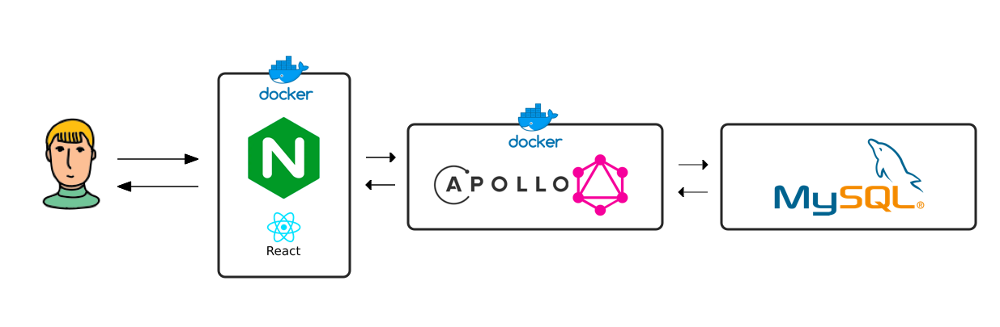
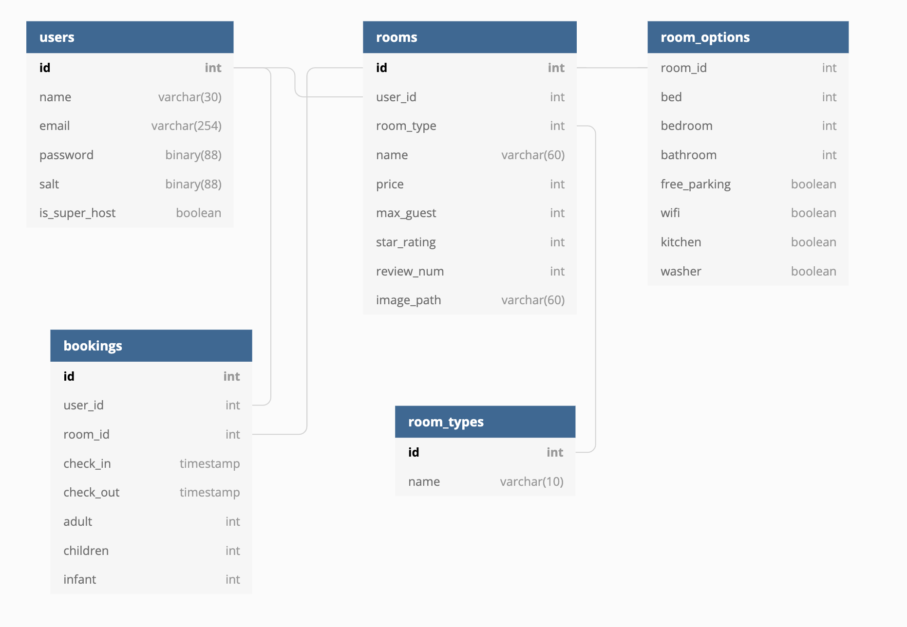

<h1 align="center">Boost bnb 👋</h1>
<p>
  
  <a href="https://github.com/YukJiSoo/umchan-server">
    
  </a>
</p>

## Server Architecture



-   3개의 server 생성
-   사용자는 NginX server로만 요청 가능

### NginX

-   react app을 build한 정적파일 serving
-   reverse proxy
-   docker

### GraphQL API Server

-   Apollo library 사용
-   docker

### DB Server

-   MySQL

## Deploy

http://101.101.162.177

## Insatll

1. React + NginX server docker image 생성 후 실행

```
cd react-app
docker build -t react-nginx-server .
docker run -it -d -p 80:80 react-nginx-server
```

2. GraphQL API server docker image 생성 후 실행

```
cd api-server
docker build -t graphql-api-server .
docker run -it -d -p 4000:4000 graphql-api-server
```

## Design

### DB table 구조


[Link](https://dbdiagram.io/d/5da49c13ff5115114db53be8)

## Author

👤 **Yuk Jisu**

-   Github: [@YukJiSoo](https://github.com/YukJiSoo)
